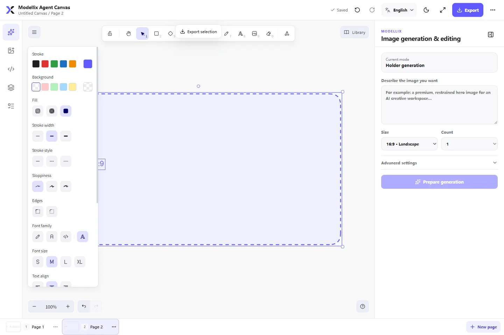
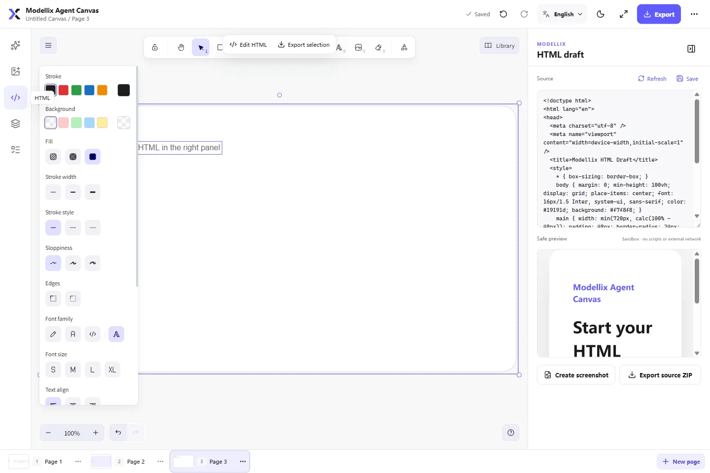
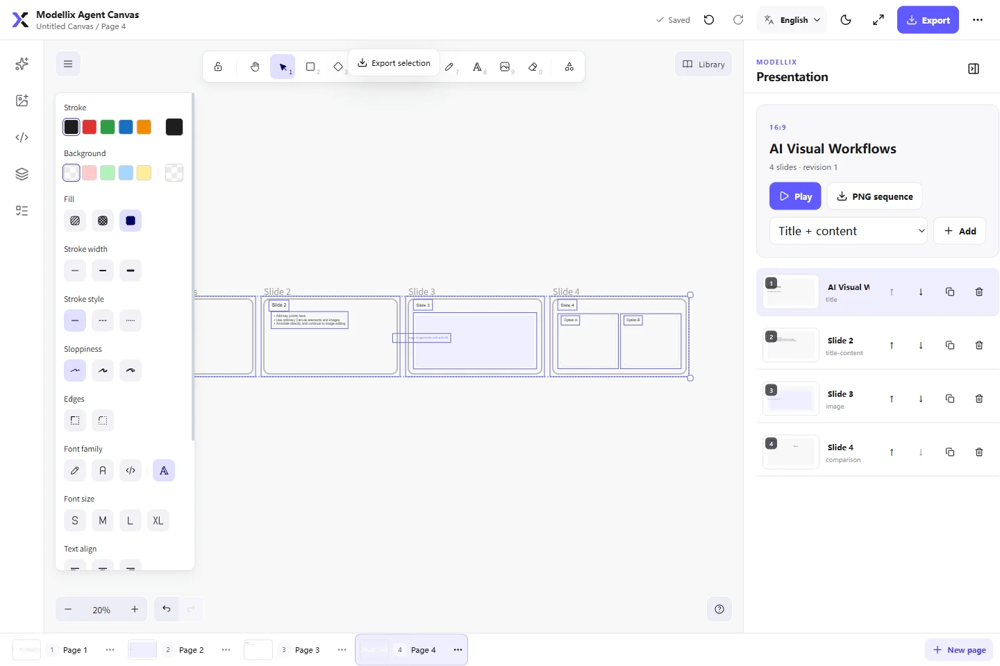

# Modellix Agent Canvas

**English** · [简体中文](docs/README.zh-CN.md)

[](https://www.npmjs.com/package/@modellix/agent-canvas)

Modellix Agent Canvas is a local, workspace-bound `stdio` MCP plugin for visual AI work. It brings an Excalidraw infinite canvas, Modellix image generation and editing, paid-operation confirmation, durable task recovery, HTML drafts, presentations, and project-local persistence into one workspace.

It supports Codex, Cursor, Claude Code, OpenCode, and other applications that implement local `stdio` MCP. Hosts with MCP Apps can embed the complete canvas; other compatible hosts use the same MCP server through a short-lived loopback page. Canvas runs locally and does not require a deployed Canvas service.

## Product tour

### AI image workflow

Start with a canvas placeholder, then choose the output size, count, background, quality, and placement behavior. Paid generation is still protected by a separate preview and confirmation step.



### Safe HTML drafts

Edit HTML source beside an isolated live preview, capture it back to the canvas, or export the source as a ZIP archive.



### Presentation editor

Create editable slide decks from several layouts, manage slides visually, present them, or export a PNG sequence.



## What it includes

- **Infinite canvas:** text, shapes, lines, arrows, freehand drawing, frames, images, grouping, locking, layers, alignment, a project-persisted personal library, and action-level undo and redo.
- **Multi-page projects:** create, rename, duplicate, reorder, and delete pages while preserving an independent viewport and history for every page.
- **Image placeholders:** reserve a target area before generation; the selected result replaces the placeholder and remains undoable, while extra results are placed predictably beside it.
- **Image generation and editing:** text-to-image, single-image editing, ordered 2–10 image references, an explicit primary reference, annotation-based editing, transparent backgrounds, fidelity controls, and 1–4 outputs.
- **Model-aware routing:** the user states the creative requirement; prepare returns the selected model, routing reason, effective specification, limitations, and estimated total cost.
- **Paid-operation safety:** prepare is free, submit requires an explicit one-time confirmation, duplicate work is locally deduplicated, and an unknown submission is never retried automatically.
- **Durable tasks:** task IDs, state transitions, and local results are persisted in an append-only ledger, so work can continue after the host or browser closes.
- **HTML drafts:** source editing, CSP-restricted sandbox preview, refresh, canvas capture, and source ZIP export.
- **Presentations:** 16:9, 4:3, and custom ratios; title, content, image, comparison, and blank layouts; thumbnails, reordering, duplication, presentation mode, and PNG-sequence export.
- **Import and export:** selected area or full-page PNG/SVG at 1×, 2×, or 4×, presentation PNG ZIP, and confirmed project JSON backup restore.
- **English, Chinese, and Japanese UI:** English is the default. The language switch in the upper-right updates the Canvas, Excalidraw controls, and secure API Key form, and the choice is saved with the project.
- **Local security:** credentials use the `modellix-cli` system credential store and are never written to chat, MCP arguments, URLs, project files, or task ledgers.

## Requirements

- Node.js `^20.19.0 || >=22.12.0`
- Access to the production API at `https://api.modellix.ai`
- A valid API Key from the [Modellix console](https://www.modellix.ai/console/api-key)

Choose one installation path only. Codex, Cursor, and Claude users install once from the host's Git or Marketplace entry; the plugin loads its manifest and Skills and automatically resolves the pinned npm runtime in the background. OpenCode and generic MCP users add the npm-backed MCP once. Users never run a second npm or CLI installation command. The cached runtime includes the complete production dependency tree and exact `modellix-cli 0.0.8`. If the CLI already has a valid credential for the production API origin, Canvas reuses it and skips setup; otherwise the first-use prompt only asks for a Modellix API Key.

Run `npx -y --package @modellix/agent-canvas@0.1.15 modellix-agent-canvas --doctor` on any supported host to verify Node.js, production dependencies, the bundled Widget, and the active package version.

## Quick start

Install from the host's plugin interface whenever possible.

### Codex

```sh
codex plugin marketplace add Modellix/modellix-agent-canvas
codex plugin add modellix-agent-canvas@modellix
```

The Git marketplace installs the plugin files from this repository. Its Codex adapter starts a single Node bootstrap process, installs the pinned npm runtime into a user-local cache on first use, and then imports the MCP server into that same process. Warm starts reuse the validated cache without retaining an `npx` wrapper process or requiring a global CLI installation.

### Cursor

Run the following command in Cursor:

```text
/add-plugin modellix-agent-canvas
```

For a GitHub or local-checkout install, open **Customize → Plugins → + Add** and select the repository root. Cursor reads `.cursor-plugin/marketplace.json`, then offers **Modellix Agent Canvas** from the `modellix` personal marketplace. This is separate from the Open Plugins metadata submitted to Cursor Directory.

### Claude Code

```sh
claude plugin marketplace add Modellix/modellix-agent-canvas
claude plugin install modellix-agent-canvas@modellix
```

After enabling or upgrading the plugin, run `/reload-plugins`, then use `/mcp` to verify the connection.

### OpenCode and other MCP hosts

Use the public npm package [`@modellix/agent-canvas`](https://www.npmjs.com/package/@modellix/agent-canvas). Ready-to-merge host configurations are included in this repository. See the [complete installation guide](docs/installation.en.md) for setup, verification, upgrades, uninstallation, and source development.

After installation, call:

```text
get_modellix_canvas_status { "refresh": true, "workspacePath": "<absolute project path>" }
open_modellix_canvas { "workspacePath": "<the same absolute project path>" }
```

If status is `missing` or `invalid`, Canvas displays a password input directly in its credential card. The field follows the language selected in the upper-right and is an isolated, one-time loopback form that expires after five minutes; submitting it validates the key through the bundled CLI, stores it in the system credential store, and automatically refreshes Canvas status. The Key never enters Canvas state or MCP tool arguments. `start_modellix_api_key_setup` remains available to integrations that need to obtain the same short-lived local form explicitly.

## Host compatibility

| Host | Local MCP | Canvas surface | Configuration |
| --- | --- | --- | --- |
| Codex | `stdio` | MCP Apps widget, with local fallback | `.codex-plugin/plugin.json` (mirrored by `.mcp.codex.json`) |
| Cursor 2.6+ | `stdio` | MCP Apps | `.cursor-plugin/marketplace.json`, `.cursor-plugin/plugin.json`, `mcp.json` |
| Claude Code | `stdio` | Short-lived local page | `.claude-plugin/plugin.json`, `.mcp.claude.json` |
| OpenCode | Local MCP command | Short-lived local page | `adapters/opencode/opencode.json`, `.agents/skills` |
| OpenCode V2 beta | Local MCP command | Short-lived local page | `adapters/opencode/opencode-v2.json`, `.agents/skills` |

Use the adapter intended for the target host. The root `.mcp.json` and `.plugin/plugin.json` are the vendor-neutral Open Plugins entry for Cursor Directory; the Codex manifest embeds the Codex-specific server configuration and `.mcp.codex.json` mirrors it for direct development, while direct Cursor setup uses `mcp.json`. See [host compatibility](docs/host-compatibility.md) for protocol mappings, host-specific UI behavior, and validation status.

### Standard Cursor MCP configuration

The root `mcp.json` runs:

```text
npx -y --package @modellix/agent-canvas@0.1.15 modellix-agent-canvas --host cursor --supports-mcp-apps true
```

The template does not contain an API Key. Cursor supplies the active workspace through MCP Roots; the template intentionally avoids unportable `${workspaceFolder}` interpolation.

### Claude Code source development

```sh
claude mcp add --transport stdio modellix-agent-canvas -- node /absolute/path/modellix-agent-canvas/scripts/start-mcp.mjs --host claude-code --supports-mcp-apps false --project-dir /absolute/path/to/project
```

### OpenCode

For the stable OpenCode release, merge `mcp.modellix-agent-canvas` from `adapters/opencode/opencode.json` into the project configuration. OpenCode V2 beta users should instead merge `mcp.servers.modellix-agent-canvas` from `adapters/opencode/opencode-v2.json`. Both adapters start `@modellix/agent-canvas@0.1.15` from the active workspace and use the local page fallback.

## API Key and privacy

Credential resolution is deliberately simple:

1. Check the credentials already persisted by `modellix-cli`.
2. Reuse a valid credential when available.
3. Otherwise, enter a key in the isolated setup field embedded in the Canvas credential card.

Do not place a key in chat, tool arguments, command-line arguments, repository files, screenshots, project backups, or task reports. Canvas does not store keys in `localStorage`, `sessionStorage`, or IndexedDB.

Prompts and input images are sent to Modellix only after the user confirms the paid task. Prepare reads model capability and pricing data but does not upload references or create a paid task. Completed outputs are downloaded immediately into project assets, avoiding dependence on expiring remote result URLs.

## Image routing

| Requirement | Default capability route |
| --- | --- |
| Standard opaque text-to-image | GPT Image 2 |
| Transparent text-to-image | GPT Image 1.5 |
| Standard single-image editing | GPT Image 2 Edit |
| Transparent, strict-fidelity, or standard multi-image editing | GPT Image 1.5 Edit |
| Multi-reference editing with special ratios or 2K/4K output | Nano Banana Pro Edit |

The production API supplies the current model catalog, capabilities, and price. Canvas selects only from approved candidates. If no model satisfies every hard requirement, it returns `CAPABILITY_CONFLICT` or `MODEL_UNAVAILABLE` instead of silently degrading or creating a paid task.

The paid workflow is:

1. `prepare_modellix_image_task` resolves ordered references, selects a model, and returns a short-lived confirmation fingerprint.
2. The UI or agent displays the actual model, routing reason, effective specification, quantity, warnings, and estimated total cost.
3. After explicit user approval, `submit_modellix_image_task` submits the unchanged intent with the same fingerprint.
4. `get_modellix_image_task` polls only registered tasks. `SUBMISSION_UNKNOWN` is query-only and must never trigger an automatic resubmission.
5. `finalize_modellix_image_task` validates downloads, writes content-addressed assets, and places results at the placeholder or beside the source.

## MCP tools

The agent-facing workflow uses:

- `get_modellix_canvas_status`
- `start_modellix_api_key_setup`
- `open_modellix_canvas`
- `get_canvas_context`
- `create_canvas_page`, `rename_canvas_page`, and `delete_canvas_page`
- `prepare_modellix_image_task`
- `submit_modellix_image_task`
- `get_modellix_image_task`
- `list_modellix_canvas_tasks`
- `finalize_modellix_image_task`
- `cleanup_modellix_canvas_uploads`, which requires `confirmCleanup: true` and affects only terminal temporary uploads recorded in the ledger

`get_canvas_project`, `save_canvas_project`, and `save_canvas_asset` are app-only MCP Apps data channels. They keep large scene JSON and base64 assets out of model context. Every tool returns stable error codes, retryability, and recovery guidance.

## Project data

Each bound workspace stores data under:

```text
.modellix/canvas/
├── project.json
├── pages/<page-id>.json
├── assets/
│   ├── images/
│   ├── html/
│   └── exports/
├── tasks/
│   ├── snapshot.json
│   ├── events.jsonl
│   └── staging/
├── recovery/
└── locks/
```

- Images are SHA-256 content-addressed and deduplicated; page JSON stores relative asset IDs.
- Project and page writes use temporary files, flush, atomic replacement, and revision conflict checks.
- Recovery snapshots are created before writes; an older build never overwrites an unknown schema version in place.
- Real-path, symbolic-link, junction, and workspace-boundary checks protect every file operation.
- Task ledgers exclude API Keys, full prompt text, input images, remote temporary URLs, and absolute local paths.

## Loopback and HTML security

The fallback page listens only on `127.0.0.1` with an ephemeral system-assigned port and enforces:

- A one-time high-entropy open token and short-lived `HttpOnly; SameSite=Strict` session
- Host, Origin, HTTP method, Content-Type, and request-size validation
- Strict CSP, `no-store`, `no-referrer`, and `nosniff`
- No remote scripts, fonts, analytics, or general-purpose file proxy

HTML drafts run in a separate sandboxed iframe with its own CSP. External networking, top-level navigation, pop-ups, downloads, device permissions, and host APIs are disabled by default.

## Development and release checks

```sh
npm ci
npm run sync:skills
npm run check
npm run check:licenses
npm run check:plugin
npm test
npm run build
npm run build:widget
npm run probe:mcp
npm audit --audit-level=moderate
```

`npm run quality` runs the complete local gate except `npm audit` and the real packed-install smoke test. `npm run smoke:package` installs the publishable package with lifecycle scripts disabled and probes the complete MCP.

Before release, use `npm pack --dry-run` to confirm that the package contains no QA origin, internal acceptance material, absolute path, test credential, or obsolete resource.

## Common errors

- `WORKSPACE_UNBOUND`: provide the active project's absolute `workspacePath`, or restart MCP from the actual user project with `--project-dir`.
- `WORKSPACE_BOUNDARY_VIOLATION`: a path or linked target resolved outside the bound workspace.
- `AUTH_REQUIRED` / `AUTH_INVALID`: use or regenerate the secure input inside the credential card; do not send the key through chat.
- `ROUTE_CHANGED_RECONFIRM_REQUIRED`: an input, reference order, specification, price, or expiry changed; prepare and confirm again.
- `SUBMISSION_UNKNOWN`: do not resubmit; continue polling the existing operation from the task center.
- `FINALIZE_CONFLICT`: inspect whether the intended target moved or was deleted, then choose a recovery location.
- `REVISION_CONFLICT`: another session updated the project; reload before reapplying the current change.
- `No marketplace manifest found`: when using **Customize → Plugins → + Add**, select the repository root containing `.cursor-plugin/marketplace.json`; loading a standalone plugin for development uses `~/.cursor/plugins/local/modellix-agent-canvas` instead.

## Upgrade and uninstall

Host-specific commands are documented in [Upgrade and uninstall](docs/installation.en.md#upgrade-and-uninstall). Upgrading does not delete `.modellix/canvas/`. Uninstalling also preserves workspace data and system credentials, preventing accidental deletion of keys shared by other Modellix tools. To remove a credential, run `modellix-cli auth logout` for the corresponding profile.

## License

Project-owned code is available under the [MIT License](LICENSE). The canvas engine uses `@excalidraw/excalidraw 0.18.1` under MIT; the `modellix-cli 0.0.8` runtime dependency retains its MIT license. See [THIRD_PARTY_NOTICES.md](THIRD_PARTY_NOTICES.md) and [THIRD_PARTY_LICENSES](THIRD_PARTY_LICENSES).
