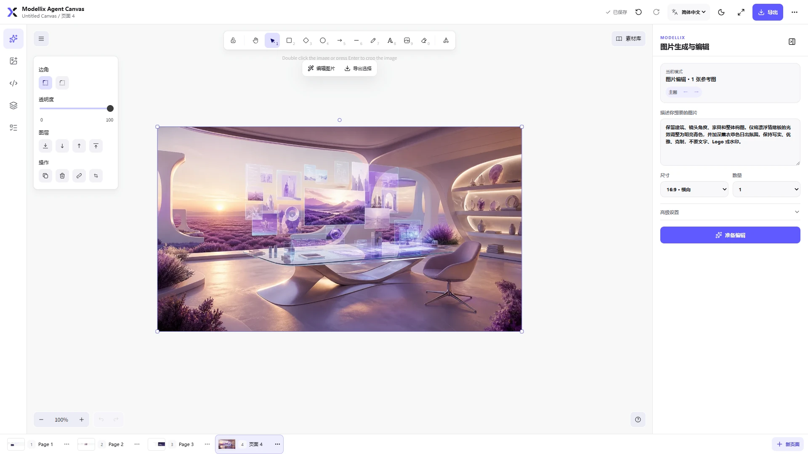
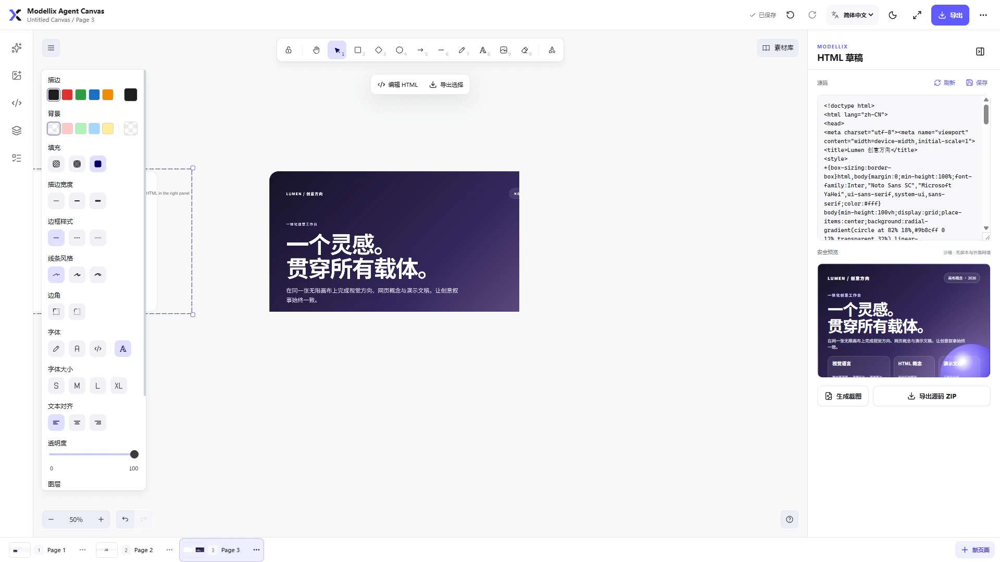
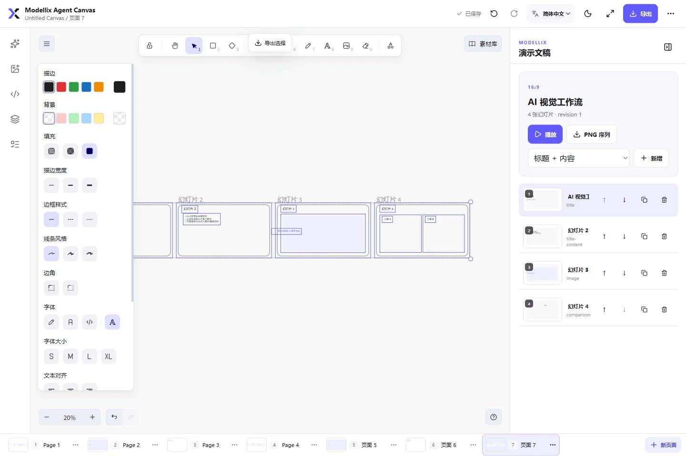

# Modellix Agent Canvas

[English](../README.md) · **简体中文**

[](https://www.npmjs.com/package/@modellix/agent-canvas)

Modellix Agent Canvas 是一个完全在本机运行的通用 `stdio` MCP 画布插件。它把 Excalidraw 无限画布、Modellix 图片生成与编辑、付费确认、异步任务恢复、HTML 草稿、演示文稿和项目持久化统一到一个工作区中。

插件适用于 Codex、Cursor、Claude Code、OpenCode，以及其他支持本地 `stdio` MCP 的应用。支持 MCP Apps 的宿主可直接嵌入完整画布；尚未提供 MCP Apps 的宿主使用同一 MCP 服务返回的短期 loopback 页面。Canvas 本身不需要部署远程服务。

## 产品截图

### AI 图片工作流

从画布占位符开始，配置生成规格、输出数量、背景与质量；付费任务仍需在提交前单独确认。



### HTML 安全草稿

在右侧编辑源码并实时查看隔离预览，可生成画布截图或导出源码 ZIP。



### 演示文稿编辑器

快速创建多种比例与布局的可编辑幻灯片，并播放或导出 PNG 序列。



## 功能

- Excalidraw 无限画布：文本、常用图形、线条、箭头、自由绘制、Frame、图片、分组、锁定、层级、对齐、撤销与重做。
- 多页面项目：新建、重命名、复制、排序、删除、独立视口和独立页面历史。
- AI 图片占位符：生成完成后按占位符位置和尺寸替换，可撤销；其余结果稳定排列在右侧。
- 图片生成与编辑：文生图、单图编辑、2～10 张有序参考图、明确主图、标注截图编辑、透明背景、输入保真和 1～4 个输出。
- 自动模型路由：用户只描述业务需求，预检返回实际模型、路由原因、有效规格、限制和预计费用。
- 付费安全：prepare 不收费；submit 需要一次性确认；并发和重复操作本地去重；未知提交状态绝不自动重提。
- 任务恢复：任务 ID、状态与本地结果使用追加式账本持久化；宿主或浏览器关闭后仍可继续查询、下载和 finalize。
- HTML 草稿：源码编辑、CSP 沙箱预览、刷新、画布截图和源码 ZIP 导出。
- 演示文稿：16:9、4:3、自定义比例，标题/内容/图片/对比/空白模板，新增、复制、重命名、删除、排序、缩略图、播放和 PNG 序列导出。
- 导出：选择区或页面 PNG/SVG、演示文稿 PNG ZIP、项目 JSON 备份。
- 中英日三语界面：默认英语；右上角语言切换会同步更新 Canvas、Excalidraw 控件和 API Key 安全输入表单，并随项目持久化。
- 安全持久化：API Key 复用 `modellix-cli` 的系统凭证库，不写入聊天、MCP 参数、URL、项目或任务账本。

## 运行要求

- Node.js `^20.19.0 || >=22.12.0`
- 可访问正式 API：`https://api.modellix.ai`
- 一个可用的 Modellix API Key，可在 [Modellix 控制台](https://www.modellix.ai/console/api-key) 创建

发布包会自动安装精确版本 `modellix-cli 0.0.8` 作为通用运行依赖，用户不需要全局安装 CLI。若用户已在正式 API origin 的 CLI 默认 Profile 中配置有效凭证，Canvas 会直接复用，不再要求输入 Key。

## 最快使用方式

安装方式必须二选一。Codex、Cursor、Claude 用户只从宿主的 Git 或 Marketplace 入口安装一次，插件会自动加载 Skills，并在后台解析和缓存固定版本 npm 运行时；用户不需要再执行 npm 或 `modellix-cli` 安装。OpenCode 和通用 MCP 用户只添加一次 npm MCP。已有凭证直接复用，否则首次打开只提示输入 Modellix API Key。Codex：

```sh
codex plugin marketplace add Modellix/modellix-agent-canvas
codex plugin add modellix-agent-canvas@modellix
```

Claude Code：

```sh
claude plugin marketplace add Modellix/modellix-agent-canvas
claude plugin install modellix-agent-canvas@modellix
```

Cursor 使用 `/add-plugin modellix-agent-canvas` 从插件市场安装；从 GitHub 或本地检出安装时，在 **Customize → Plugins → + Add** 中选择仓库根目录，Cursor 会读取 `.cursor-plugin/marketplace.json`。OpenCode 和其他 MCP 宿主使用公开 npm 包 [`@modellix/agent-canvas`](https://www.npmjs.com/package/@modellix/agent-canvas)。各宿主的完整步骤、标准 MCP 配置、升级和卸载见 [安装指南](installation.md)。

首次连接后执行：

```text
get_modellix_canvas_status { "refresh": true, "workspacePath": "<当前项目绝对路径>" }
open_modellix_canvas { "workspacePath": "<同一当前项目绝对路径>" }
```

如果状态为 `missing` 或 `invalid`，Canvas 会在凭证卡片中直接显示密码输入框。输入框跟随右上角选择的语言；它实际是隔离的本机一次性表单，5 分钟后失效。提交后由内置 CLI 验证、写入系统凭证库并自动刷新状态。Key 不会进入 Canvas 状态或 MCP 工具参数。`start_modellix_api_key_setup` 仍供需要显式取得同一安全表单的集成使用。

## 宿主配置

仓库为四个宿主提供独立适配文件。根 `.plugin/plugin.json` 与 `.mcp.json` 是供 Cursor Directory 自动发现的 Open Plugins 入口；`.cursor-plugin/marketplace.json` 与 `.cursor-plugin/plugin.json` 是 Cursor 官方、个人和本地 Marketplace 入口；Codex 使用 `.mcp.codex.json`，直接配置 Cursor 使用 `mcp.json`。

| 宿主 | 本地 MCP | 画布载体 | 配置/清单 |
| --- | --- | --- | --- |
| Codex | `stdio` | MCP Apps Widget；必要时可回退本地页 | `.codex-plugin/plugin.json`、`.mcp.codex.json` |
| Cursor 2.6+ | `stdio` | MCP Apps | `.cursor-plugin/marketplace.json`、`.cursor-plugin/plugin.json`、`mcp.json` |
| Claude Code | `stdio` | 短期本地页 | `.claude-plugin/plugin.json`、`.mcp.claude.json` |
| OpenCode | local MCP command | 短期本地页 | `adapters/opencode/opencode.json`、`.agents/skills` |
| OpenCode V2 beta | local MCP command | 短期本地页 | `adapters/opencode/opencode-v2.json`、`.agents/skills` |

### Codex

Codex 插件发布物使用 `.codex-plugin/plugin.json` 和 `.mcp.codex.json`。Modellix Marketplace 从 GitHub 仓库根目录安装插件文件，MCP 入口再通过 `npx` 启动固定版本的公开 npm 运行包：

```sh
codex plugin marketplace add Modellix/modellix-agent-canvas
codex plugin add modellix-agent-canvas@modellix
```

这种结构避免 Codex 的 npm Marketplace 解包流程遗漏 Node 运行依赖。本地开发可直接按 `.mcp.codex.json` 启动，或把仓库加入个人本地 marketplace。只有 `open_modellix_canvas` 绑定 MCP Apps UI；数据工具不会意外渲染重复 Widget。

### Cursor

Cursor 2.6 及以上使用 `/add-plugin modellix-agent-canvas` 从 Marketplace 安装。个人或本地 Marketplace 安装在 **Customize → Plugins → + Add** 中选择仓库根目录；Cursor 读取 `.cursor-plugin/marketplace.json`，再从 `modellix` Marketplace 安装插件。Cursor Directory 是另一条独立渠道，通过根 `.plugin/plugin.json` 与 `.mcp.json` 自动发现插件。两种入口都使用 Cursor 官方支持的 MCP Roots 绑定当前工作区，不依赖插件配置中无法可靠展开的 `${workspaceFolder}`。所有入口都通过 `npx -y --package @modellix/agent-canvas@0.1.12 modellix-agent-canvas` 显式启动固定运行包，避免全新 npm 缓存无法从包名推断可执行文件。模板不保存 Key；连接后在 Canvas 内的隔离输入框完成配置。

### Claude Code

插件发布物使用 `.claude-plugin/plugin.json`，Marketplace 明确选择 `.mcp.claude.json`。它通过固定版本 npm 运行时启动服务器、使用 `${CLAUDE_PROJECT_DIR}` 绑定项目，并且不把 Key 写入插件配置：

```sh
claude plugin marketplace add Modellix/modellix-agent-canvas
claude plugin install modellix-agent-canvas@modellix
```

启用或更新插件后执行 `/reload-plugins`，再用 `/mcp` 查看连接状态。源码开发也可以按 Claude Code 官方 `stdio` 方式添加本地服务器：

```sh
claude mcp add --transport stdio modellix-agent-canvas -- node /absolute/path/modellix-agent-canvas/scripts/start-mcp.mjs --host claude-code --supports-mcp-apps false --project-dir /absolute/path/to/project
```

### OpenCode

OpenCode 稳定版把 `adapters/opencode/opencode.json` 中的 `mcp.modellix-agent-canvas` 合并到项目配置；OpenCode V2 beta 改用 `adapters/opencode/opencode-v2.json` 中的 `mcp.servers.modellix-agent-canvas`。两种配置都通过 `npx -y --package @modellix/agent-canvas@0.1.12 modellix-agent-canvas` 启动，并从当前工作区打开短期本地画布；无需预装全局 CLI 或运行第二次安装命令。

更完整的配置边界与验证状态见 [宿主兼容说明](host-compatibility.md)。

## API Key 与隐私

凭证优先级：

1. 检查 `modellix-cli` 已有的持久凭证。
2. 若存在有效凭证，直接复用。
3. 仍无有效凭证时，直接在 Canvas 凭证卡片的隔离输入框中完成设置。

不要把 Key 放入聊天、工具参数、命令行参数、仓库文件、截图、项目备份或任务报告。插件不使用 `localStorage`、`sessionStorage` 或 IndexedDB 保存 Key。

Prompt 和输入图片只在用户确认付费任务后发送到 Modellix。预检只读取模型能力和报价，不上传参考图，也不创建付费任务。完成结果会立即下载到项目资产目录，避免依赖会过期的远程结果 URL。

## 图片路由

| 需求 | 默认能力路由 |
| --- | --- |
| 普通不透明文生图 | GPT Image 2 |
| 透明背景文生图 | GPT Image 1.5 |
| 单图普通编辑 | GPT Image 2 Edit |
| 透明、严格保真或标准多图编辑 | GPT Image 1.5 Edit |
| 多参考图且要求特殊比例或 2K/4K | Nano Banana Pro Edit |

模型目录、能力和报价来自正式 API。Canvas 只在批准候选集合中选择；没有同时满足硬条件的模型时返回 `CAPABILITY_CONFLICT` 或 `MODEL_UNAVAILABLE`，不会静默降级或产生付费任务。

标准工作流：

1. `prepare_modellix_image_task` 解析有序参考图、选择模型并返回短期确认指纹。
2. UI/Agent 展示实际模型、原因、规格、数量、限制和预计总费用。
3. 用户明确确认后，`submit_modellix_image_task` 使用完全相同的意图和指纹提交。
4. `get_modellix_image_task` 只查询已登记任务；`SUBMISSION_UNKNOWN` 只能查询恢复，不能自动重提。
5. 成功后 `finalize_modellix_image_task` 校验下载文件、写入内容寻址资产，并按占位符或原图右侧布局插入。

## MCP 工具

面向 Agent 的主要工具：

- `get_modellix_canvas_status`
- `start_modellix_api_key_setup`
- `open_modellix_canvas`
- `get_canvas_context`
- `create_canvas_page` / `rename_canvas_page` / `delete_canvas_page`
- `prepare_modellix_image_task`
- `submit_modellix_image_task`
- `get_modellix_image_task`
- `list_modellix_canvas_tasks`
- `finalize_modellix_image_task`
- `cleanup_modellix_canvas_uploads`（仅对账本登记的终态临时上传生效，并要求 `confirmCleanup: true`）

`get_canvas_project`、`save_canvas_project` 与 `save_canvas_asset` 是 MCP Apps 的 app-only 数据通道，用于避免把大场景 JSON 和 base64 暴露给模型。所有工具统一返回稳定错误码、可重试属性和恢复建议。

## 项目数据

每个绑定工作区使用以下目录：

```text
.modellix/canvas/
├── project.json
├── pages/<page-id>.json
├── assets/
│   ├── images/
│   ├── html/
│   └── exports/
├── tasks/
│   ├── snapshot.json
│   ├── events.jsonl
│   └── staging/
├── recovery/
└── locks/
```

- 图片按 SHA-256 内容寻址并去重，页面 JSON 只保存相对 asset ID。
- 项目和页面使用临时文件、flush、原子替换与 revision 冲突检查。
- 保存前生成恢复快照；未知 schema 版本不会被旧版本原地覆盖。
- 所有路径执行真实路径、符号链接/junction 与工作区边界校验。
- 任务账本不保存 API Key、Prompt 正文、输入图片、远程临时 URL或本机绝对路径。

## 本地网页安全

回退页面只监听 `127.0.0.1` 的系统随机端口，并使用：

- 一次性高熵打开令牌和短期 `HttpOnly; SameSite=Strict` 会话
- `Host`、`Origin`、HTTP method、Content-Type 与 body 大小校验
- 严格 CSP、`no-store`、`no-referrer` 和 `nosniff`
- 不加载远程脚本、字体、分析或通用文件代理

HTML 草稿预览使用独立 sandbox iframe 和 CSP，默认禁止外联、顶层导航、弹窗、下载、设备权限和宿主 API。

## 开发与发布检查

```sh
npm ci
npm run sync:skills
npm run check
npm run check:licenses
npm run check:plugin
npm test
npm run build
npm run build:widget
npm run probe:mcp
npm audit --audit-level=moderate
```

`npm run quality` 会执行除 `npm audit` 和真实 npm 安装包冒烟测试外的完整本地门禁。`npm run smoke:package` 会以关闭生命周期脚本的方式安装发布包并探测完整 MCP；Canvas 使用精确的 `modellix-cli` npm 依赖，不复制或修改 CLI 源仓库。

发布前还应检查 `npm pack --dry-run`，确认包中没有 QA 地址、内部验收资料、绝对路径、测试凭证或未使用的历史资源。

## 常见错误

- `WORKSPACE_UNBOUND`：Codex 可让状态或打开工具携带当前项目的绝对 `workspacePath`；其他宿主也可从真实用户项目重新启动 MCP，并提供 `--project-dir`。
- `WORKSPACE_BOUNDARY_VIOLATION`：文件或符号链接解析到了绑定工作区之外。
- `AUTH_REQUIRED` / `AUTH_INVALID`：使用或重新生成凭证卡片中的安全输入框，不要在聊天中发送 Key。
- `ROUTE_CHANGED_RECONFIRM_REQUIRED`：输入、参考图顺序、规格、报价或有效期已改变；重新预检和确认。
- `SUBMISSION_UNKNOWN`：不要重新提交；到任务中心继续查询现有 operation。
- `FINALIZE_CONFLICT`：确认原目标是否已被删除或移动，再按提示选择恢复位置。
- `REVISION_CONFLICT`：项目已由另一个会话更新，重新加载后再应用当前修改。

## 升级与卸载

各宿主的升级和卸载命令见 [安装指南](installation.md#升级与卸载)。升级插件不会删除工作区中的 `.modellix/canvas/`。卸载插件也不会自动删除项目数据或系统凭证；这避免误删其他 Modellix 工具共用的有效 Key。需要移除凭证时使用对应 profile 的 `modellix-cli auth logout`。

## 开源协议

项目自有代码按 [MIT License](../LICENSE) 发布。画布引擎使用 `@excalidraw/excalidraw 0.18.1`（MIT）；运行依赖 `modellix-cli 0.0.8` 同样按其 MIT 许可证分发。完整第三方声明见 [THIRD_PARTY_NOTICES.md](../THIRD_PARTY_NOTICES.md) 与 [THIRD_PARTY_LICENSES](../THIRD_PARTY_LICENSES)。

[English documentation](../README.md)
